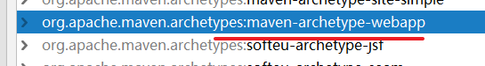
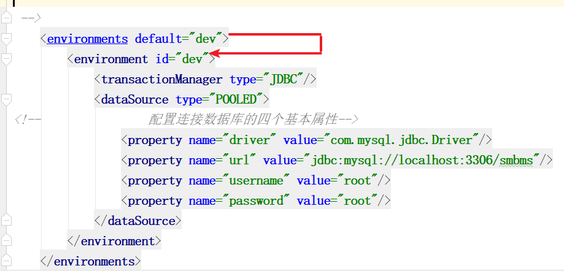
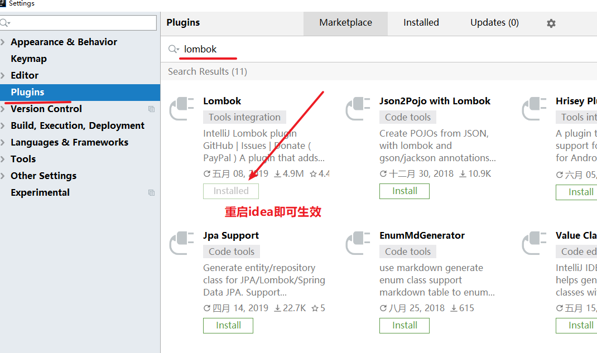
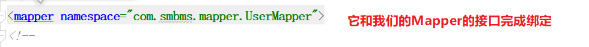
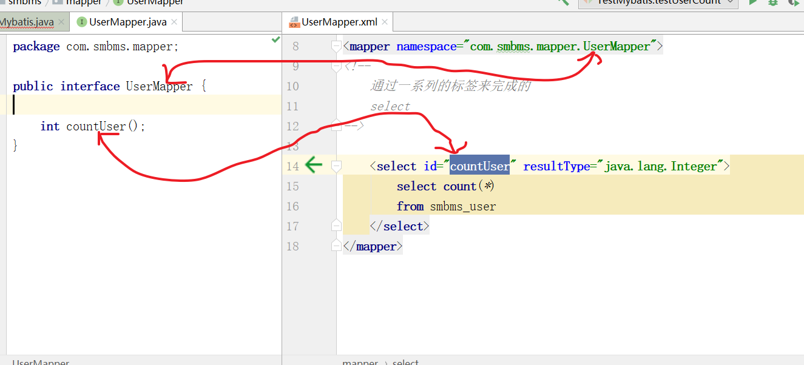

# 笔记

## mybatis开发环境搭建

### 1 新建maven项目




### 2 引入mybatis依赖，mysql依赖

```xml
  <dependency>
      <groupId>junit</groupId>
      <artifactId>junit</artifactId>
      <version>4.12</version>
      <scope>test</scope>
    </dependency>

<!--
  mybatis依赖
  如果你的没有提示，要去maven的中央仓库搜索mybatis
  https://mvnrepository.com/

-->
    <dependency>
      <groupId>org.mybatis</groupId>
      <artifactId>mybatis</artifactId>
      <version>3.5.1</version>
    </dependency>
    <dependency>
      <groupId>mysql</groupId>
      <artifactId>mysql-connector-java</artifactId>
      <version>5.1.47</version>
    </dependency>
   <dependency>
      <groupId>org.projectlombok</groupId>
      <artifactId>lombok</artifactId>
      <version>1.18.8</version>
      <scope>provided</scope>
    </dependency>
```


### 3 编写mybatis的核心配置文件

```xml
<?xml version="1.0" encoding="UTF-8" ?>
<!DOCTYPE configuration
        PUBLIC "-//mybatis.org//DTD Config 3.0//EN"
        "http://mybatis.org/dtd/mybatis-3-config.dtd">

<configuration>

<!--
    核心配置
-->
<!--   环境们  default使用哪个环境
    开发的时候，一般会区分不同的环境
    dev
    test
    prod

 -->
    <environments default="dev">
        <environment id="dev">
            <transactionManager type="JDBC"/>
            <dataSource type="POOLED">
<!--                配置连接数据库的四个基本属性-->
                <property name="driver" value="com.mysql.jdbc.Driver"/>
                <property name="url" value="jdbc:mysql://localhost:3306/smbms"/>
                <property name="username" value="root"/>
                <property name="password" value="root"/>
            </dataSource>
        </environment>
    </environments>
</configuration>
```





### 4 编写pojo

```java
package com.smbms.pojo;

import lombok.Data;

import java.util.Date;

/**
 * @author 邱道长
 * 2019/07/16
 */
@Data
public class User {
    private Long id;
    private String userCode;
    private String userName;
    private String userPassword;
    private Integer gender;
    private Date birthday;
    private String phone;
    private String address;
    private Long userRole;
    private Long createdBy;
    private Date creationDate;
    private Long modifyBy;
    private Date modifyDate;

//    idbigint(20) NOT NULL主键ID
//    userCodevarchar(15) NULL用户编码
//    userNamevarchar(15) NULL用户名称
//    userPasswordvarchar(15) NULL用户密码
//    genderint(10) NULL性别（1:女、 2:男）
//    birthdaydate NULL出生日期
//    phonevarchar(15) NULL手机
//    addressvarchar(30) NULL地址
//    userRolebigint(20) NULL用户角色（取自角色表-角色id）
//    createdBybigint(20) NULL创建者（userId）
//    creationDatedatetime NULL创建时间
//    modifyBybigint(20) NULL更新者（userId）
//    modifyDatedatetime NULL更新时间
}

```


省略一下get set 引入lombok 工具

​	4.1 我们要提供下@Data注解

​	4.2 我们要安装一个lombok插件




### 5 编写Mapper.xml

这个文件我们要放到resources文件夹下

```xml
<?xml version="1.0" encoding="UTF-8" ?>
<!DOCTYPE mapper
        PUBLIC "-//mybatis.org//DTD Mapper 3.0//EN"
        "http://mybatis.org/dtd/mybatis-3-mapper.dtd">
<!--
    定义一个namespace  命名空间，我们可以唯一限定我们的是用哪个文件
-->
<mapper namespace="com.smbms.mapper.UserMapper">
<!--
    通过一系列的标签来完成的
    select 
-->

    <select id="countUser" resultType="java.lang.Integer">
        select count(*)
        from smbms_user
    </select>
</mapper>
```

5.1 记得将这个文件引入到mybatis核心配置文件

```xml
    <mappers>
<!--        写了这样，mybatis才知道这个文件的存在-->
        <mapper resource="mapper/UserMapper.xml"/>
    </mappers>
```


### 6 通过mybatis的核心API操作我们的数据库

```java
import org.apache.ibatis.io.Resources;
import org.apache.ibatis.session.SqlSession;
import org.apache.ibatis.session.SqlSessionFactory;
import org.apache.ibatis.session.SqlSessionFactoryBuilder;
import org.junit.Test;

import java.io.IOException;
import java.io.InputStream;

/**
 * @author 邱道长
 * 2019/07/16
 */
public class TestMybatis {

    // 测试用户表里面数据总量
    @Test
    public void testUserCount(){

        // 1 读取核心的配置文件
        String resource = "mybatis.cfg.xml";
        // 2 提供了一个Resources工具类，将我们的文件转换为输入流对象，再去解析
        try {
            InputStream in = Resources.getResourceAsStream(resource);
            // 3 我们使用SqlSessionFactoryBuilder来构建会话工厂
            SqlSessionFactory sqlSessionFactory = new SqlSessionFactoryBuilder().build(in);
            // 4 利用会话工厂来生产会话
            SqlSession session = sqlSessionFactory.openSession();
            // 5 利用会话完成数据库的操作
            Object o = session.selectOne("com.smbms.mapper.UserMapper.countUser");// 写入mapper里的namespace + id
            System.out.println(o);
            // 6 记得提交事务，关闭资源
            session.commit();
            session.close();
        } catch (IOException e) {
            e.printStackTrace();
        }

    }
}

```


## 通过Mapper接口来指定







```java
 UserMapper mapper = session.getMapper(UserMapper.class);
```


mybatis它使用了代理技术实现了我们接口实例的创建

- 我们声明的仅仅是一个Mapper接口，没有实现类
- 通过mybatis创建的 动态代理技术来实现一个接口实例


如果数据库设计和java里面属性名不一致，可以通过指定别名的方式封装进行，setXXX的方法完成的。


## properties

1 字面值优先级最高

2 properties的外部的引用文件（使用占位符）

3 properties内部的值


## 别名

1 通过单个注册

​	如果我们缺省名字，默认注册就是使用简写的类名，并且不区分大小写

```xml
   <typeAliases>
        <typeAlias type="com.smbms.pojo.User"/>
    </typeAliases>
```

user

user User UsEr都是一样的。


2 包注册

```xml
<typeAliases>
    <package name="com.smbms.pojo"/>
</typeAliases>
```


下面的实验证明了别名可以有多个，并且单个别名可以包别名混用

```xml
    <typeAliases>
        <typeAlias type="com.smbms.pojo.User" alias="heroUser"/>
        <package name="com.smbms.pojo"/>
    </typeAliases>
```


**补充**

虽然提供了别名的机制，但是尽量还是使用全限定类名。

## 关于Mapper url写法方式

如果使用文件协议，一般很少使用。


